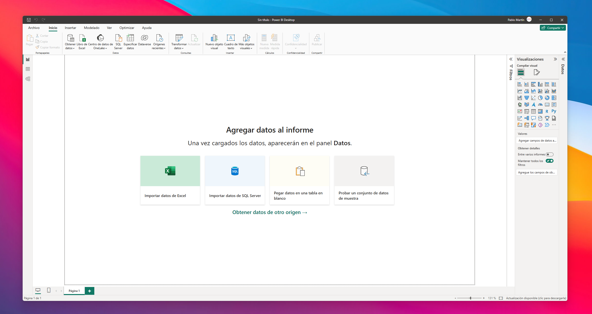

## Data Analysis Project: [Título del Proyecto]

## Descripción del Proyecto

Hello world, here I am with one of the latest projects I've been evolved. The study case prensents a company called HS that wants to measure the satisfaction level of their workers. 
In that particular case we will be working with a vbery basic dataset where we'll find some dimentional tables that will be linked and refered to a fact table.
- **Tema**: Análisis del índice de satisfacción de los empleados de la empresa HR
- **Objetivo**: Investigar la relación entre precios y crecimiento demográfico.

---

## Pasos del Proceso

### 1. Recolección de Datos
Como en todo análisis, comenzaremos con la importación de los archivos csv con los que trabajaremos. A continuación mostramos las tablas "Employee", "RatingLevel", "SatisfiedLevel", "EducationLevel" y "PerformanceRating":


### 2. Limpieza de Datos
Explica cómo limpiaste los datos:
- Eliminación de valores nulos
- Formato de las columnas

Código utilizado:
```python
import pandas as pd

# Ejemplo de limpieza
df = pd.read_csv('data/housing.csv')
df.dropna(inplace=True)
