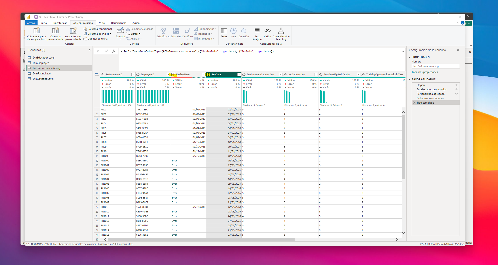
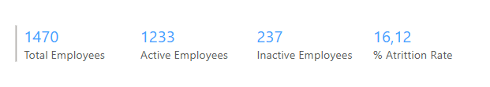
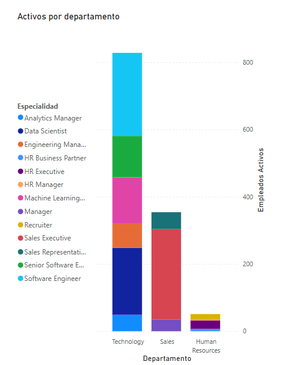

# Data Labs Project: [Estado de los empleados]

## Descripción del Proyecto

En el equipo directivo de la compañia de Atlas Lab buscan tener mayor visibilidad sobre las métricas relativas a la satisfacción y estado de sus empleados. Es por ello por lo que nos piden conocer el desgaste de la empresa. Para ello debemos explorar los datos disponibles.

**Tema**: Análisis del índice de satisfacción de los empleados de la empresa HR

**Objetivos**:
  - Conocer la tasa de empleados activos e inactivos con respecto al total registrado.  
  - Analizar sus tendencias de contratación a lo largo del tiempo para ver dónde se halla el mayor crecimiento de nuevos empleados asi como su índice de desgaste o "atrittion"
  - Conocer qué tipo de funciones están contratando dento de la organización para poder planificar futuras necesidades de contratacion

---

# Pasos del Proceso

## 1. Creación y análisis del modelo de datos

## 1.1 Recolección de Datos

Como en todo análisis, comenzaremos con la importación de los archivos csv con los que trabajaremos. A continuación mostramos las tablas "Employee", "RatingLevel", "SatisfiedLevel", "EducationLevel" y "PerformanceRating":


Como podemos observar, las tablas están bastante sanas. Tan solo debemos adaptar el tipo de dato de algunas columnas así como el formato de sus celdas. 

---


## 1.2 Limpieza de Datos

Una vez finalizada la importanción de las tablas y su renombramiento, nos decidimos a modelar los datos de manera que se muestren de una manera coherente y sólida para luego poder tratar las relaciones en la vista de modelo. Tras revisar los datoss nos encontramos con la necesidad de covertir la columna "ReviewDate" de la table "FactPerformaceRating". Como se puede apreciar observamos que los números de la fecha se ven expresados en ocasiones como un número de una sola cifra. Esto no debería de ser un problema dado que al cambiar de tipo de dato a "Date" debería interpretarlo sin mayor problema. El problema que he experimentado yo es que el formato de fecha según mi pais es dia/mes/año por lo que debo expresar las mismas fechas en una columna personalizada pero de manera ordenada. También aprovecharé esta ocasión para desarrollar un código que poder utilizar en futuras ocasiones y que consiga convertir los números que tan solo tienen una cifra en unos que cuenten con dos añadiendo un 0 delante. 

A continuación podemos observar cómo las fechas no tienen el formato deseado.
Muestra de formato no deseado:


#### ¿Cómo lo solucionamos?
Creemos una nueva columna personalizada con el siguiente codigo M dentro del editor de Power Query. 
El código en cuestión está desarrrollado en DAX

Código que hemos empleado:
```DAX
let
    // Divide and store the date in a small text array using "/" as a delimiter
    Parts = Text.Split([ReviewDate], "/"),
    
    // Make you sure that each part has two digits
    Day = Text.PadStart(Parts{1}, 2, "0"),
    Month = Text.PadStart(Parts{0}, 2, "0"),
    
    // Use the original year format
    Year = Parts{2}
in
    // Combine the parts in local data format "dd/MM/yyyy"
    Day & "/" & Month & "/" & Year

```
Con este código, a pesar de estar ya comentado dentro del mismo, observamos cómo dividimos la cadena de texto de ReviewDate (columna orginal) en un array de strings donde se ha designado como delimitador o separador el caracter "/" de tal forma que podamos almacenar cada substring a distintas variables como "Day", "Month" o "Year". Además el contenido de estas variabless va a poder contar con dos caracteres en caso de haber capturado tan solo uno. Finalmente se procede a capturar como valor resultante la conjunción de las subsstrings almacenadas en las variables de la función de manera que podremos obtener el formato de fecha adaptado al formato europeo.

Columna personalizada con datos en formato europeo:



---

## 1.3 Metodología Kimball

En esta ocasión trataremos de adoptar el modelo Snowflake ideado por Kimball dado su gran eficiencia y popularidad. Por ello trataremos de buscar qué tablas van a ser consideradas como tablas dimensionales y tabla de hechos y renombraremos cada tabla con el prefijo "Dim-" o "Fact-" en función de su tipología. A continuación se muestra la categorización propuesta:


#### 1.3.1 Tablas adicionales

Como es práctica común haremos inclusión de una tabla de fechas. Para ello hemos importado mediante el siguiente código la tabla DimDate al modelo. Gracias a esta tabla podremos relacionar todas las fechas dispuestas en la tabla de hechos con la tabla DimDate pudiendo manejar así los datos de una manera limpia y ordenada. 

El código en cuestión está desarrrollado en DAX
Código utilizado:
```DAX

DimDate = 
VAR _minYear = YEAR(MIN(DimEmployee[HireDate]))
VAR _maxYear = YEAR(MAX(DimEmployee[HireDate]))
VAR _fiscalStart = 4 

RETURN
ADDCOLUMNS(

    CALENDAR(

                DATE(_minYear,1,1),

                DATE(_maxYear,12,31)

),

"Year",YEAR([Date]),
"Year Start",DATE( YEAR([Date]),1,1),
"YearEnd",DATE( YEAR([Date]),12,31),
"MonthNumber",MONTH([Date]),
"MonthStart",DATE( YEAR([Date]), MONTH([Date]), 1),
"MonthEnd",EOMONTH([Date],0),
"DaysInMonth",DATEDIFF(DATE( YEAR([Date]), MONTH([Date]), 1),EOMONTH([Date],0),DAY)+1,
"YearMonthNumber",INT(FORMAT([Date],"YYYYMM")),
"YearMonthName",FORMAT([Date],"YYYY-MMM"),
"DayNumber",DAY([Date]),
"DayName",FORMAT([Date],"DDDD"),
"DayNameShort",FORMAT([Date],"DDD"),
"DayOfWeek",WEEKDAY([Date]),
"MonthName",FORMAT([Date],"MMMM"),
"MonthNameShort",FORMAT([Date],"MMM"),
"Quarter",QUARTER([Date]),
"QuarterName","Q"&FORMAT([Date],"Q"),
"YearQuarterNumber",INT(FORMAT([Date],"YYYYQ")),
"YearQuarterName",FORMAT([Date],"YYYY")&" Q"&FORMAT([Date],"Q"),
"QuarterStart",DATE( YEAR([Date]), (QUARTER([Date])*3)-2, 1),
"QuarterEnd",EOMONTH(DATE( YEAR([Date]), QUARTER([Date])*3, 1),0),
"WeekNumber",WEEKNUM([Date]),
"WeekStart", [Date]-WEEKDAY([Date])+1,
"WeekEnd",[Date]+7-WEEKDAY([Date]),
"FiscalYear",if(_fiscalStart=1,YEAR([Date]),YEAR([Date])+ QUOTIENT(MONTH([Date])+ (13-_fiscalStart),13)),
"FiscalQuarter",QUARTER( DATE( YEAR([Date]),MOD( MONTH([Date])+ (13-_fiscalStart) -1 ,12) +1,1) ),
"FiscalMonth",MOD( MONTH([Date])+ (13-_fiscalStart) -1 ,12) +1
)

```


#### 1.3.2 Data Model

A continuación presentamos la vista de modelo que ofrece la aplicación de Power BI donde tan solo con la importación se ha creado automáticamente una relación activa. Esta relación conecta la columna "DimEmployee" y "FactPerformanceRating" mediante la columna "EmployeeID". Esto se debe a que Power BI trata de hacer relaciones automáticas lo cual puede presentar problemas si no se hacen las relaciones de la manera adecuada. En este caso no ocasiona ningún conflicto sino lo contrario. Aun así quedan aún muchas relaciones por hacer para poder conformar el modelo de SnowFlake. 

Lo primero, dado que contamos con una tabla de fechas estableceremos relación entre la columna "RevDate" (anteriormente creada) con "Date" de la tabla "DimDate".


Aprovechando que estamoa trabajando con la tabla DimDates vamos a establecer relación entre "HireDate" de la tabla "DimEmployee" y "Date" de la tabla dimensional de fechas.


Como se puede observar, las tablas que cuentan con un mayor numero de columnas son "DimEmployee", tabla donde se expresan todos los datos y características de cada uno de los trabajadores de la empresa y la tabla de hechos "FactPerformanceRating" donde se recoge el registro de puntuaciones de satisfacción del empleado. Las demás tablas son dimensionales y en su mayoría actuan como leyenda para poder interpretar el valor numérico en distintos campos.

Así se conoce el modelo "Snowflake", se deben encontrar relaciones entre la tabla de hechos y las distintas tablas relacionales. Como apunte me gustaría resaltar que para que esto se pueda dar debe de haberse realizado un modelado de los datos en caso de no poder contar con las talbas dimensionales formateadas para tal propósito. Es decir, frecuentemente el cliente cuenta tan solo con la tabla de hechos de la cual habría que extraer los datos en tablas dimensionales distintas con el propóstio de hacer el modelo muchoo más eficiente tanto en cuestiones de velocidad como de almacenaje. Moviéndonos de nuevo a nuestro caso, como decía, contamos con las tablas dimensionales ya prediseñadas así que nos pondremos manos a la obra con las relaciones.

La tabla de hechos, como pudimos abservar, recoge las puntuaciones de satisfacción de los distintos empleados de la empresa. Es por ello por lo que, vamos a tener que relacionar estas columnas con la tabla de "DimSatisfiedLevel", concretamente con la columna "SatisfactionLevel". Por tranto, las colummnas de la tabla de hechos "JobSatisfaction", "ManagerRating", "RelationshipSatisfaction", SelfRating" y "WorkLifeBalance" deben de apuntar a dicha columna.


En Power BI tan solo puede tener activa una de estas relaciones. Este hecho no quiere decir que no podamos usar las relaciones creadas entre otras columnas pero deben de ser tratadas mediante otros métodos como el del uso de la funcion en DAX "USERRELATIOSHIP" que veremos más adelante. 

Otra relación que podemos crear es entre las columnas "EducationLevel" de "DinEducationLevel" y "Education" de "DimEmployee"


FInalmente y a continuacion podemos observar cómo ha quedado nuestro modelo de datos:


---

### 1.4 Medidas

Comencemos a pensar en qué medidas vamos a necesitar en nuestro análisis. Atendiendo a los objetivos que hemos descrito con anterioridad tratadermos de crear las siguientes:

- TotalEmployees = Muestra la cantidad de empleados totales
- ActiveEmployees = Muestra la cantidad total de empleados que aún siguen en la empresa activamente
- InactiveEmployees = Muestra la cantidad total de empleados que ya no siguen en la empresa
- % Atrittion Rate = Tasa de "abandono" de empleados. (Traducción literal: desgaste)

Para poder tener una mejor organización de nuestro proyecto, crearemos una tabla vacía llamada "_Measures" donde almacenaremos las medidas.
A continuación mostramos la creación de la tabla junto a su consiguiente mensaje de error causado por no haber indicado ningún tipo de contenido. Obviaremos ese error dado que usaremos esta tabla tan solo como "directorio" de las medidas que usaremos en nuestro report.


##TotalEmployees

Para realizar esta medida hacemos uso de la función DISTINCTCOUNT. Esta función nos ofrece la posibilidad de contar los valores únicos dentro de una columna a especificar como primer y único argumento así que emplearemos la columna "EmployeeID" dentro de la columna "DimEmployee" dado que el ID es el número que identifica a cada empleado.

```DAX
TotalEmployees = DISTINCTCOUNT(DimEmployee[EmployeeID])
```


##ActiveEmployees e InactiveEmployees

Como sabemos, para poder detectar los empleados activos dentro de la empresa debemos de filtrar aquellas filas en cuya columna "Atrittion" tenga como valor "No". Para poder hacer un uso de una función de recuento como puede ser la función COUNT aplicando un filtrado de los resultados podemos usar la función CALCULATE. Gracias a funciones como CALCULATE podemos realizar una operación con filtros aplicados a los resultados. De esta manera haremos un recuento del total de empleados que gracias al filtro aplicado como segundo argumento, se encuentran en activo.

Medida:

```DAX
ActiveEmployees = CALCULATE(COUNT(DimEmployee[Attrition]), DimEmployee[Attrition] = "No") 

```


##% Atrittion Rate

Para esta medida debemos de hallar el porcentaje de empleados inactivos frente al total. Para ello acudiremos al siguiente código. Para esta medida no hará falta hacer uso de ninguna funciónn DAX.

Medida:

```DAX
% Atrittion Rate = ([InactiveEmployees] / [TotalEmployees]) * 100

```

Una vez habirendo teniendo las medidas preparadas podremos presentarlas adecuadamente para posteriromente ser analiziadas en nuestro reporte visual.



---

### 1.5 Primeros objetos visuales

[NOTA] Las siguiente imágenes contienen un error en el objeto visual donde se exhiben las medidas "Total Employees", "Active Employees", "Innactive Employees" y "% Atrittion Rate". Disculpen el error. En las próximas visualizaciones lo verán corregido.

#### 1.5.1 Distribución y proporción de contrataciones en el tiempo

Ahora toca pensar en cómo disponer la información obtenida tras haber sido depurada, relacionada y calculada. En primer lugar queremos poner a disposición del cliente un gráfico de barras verticales apiladas que muestre por fecha el número de empleados contratados. En cada año vamos a querer expresar cuántos de estos empleados que fueron contratados ya no se encuentran trabajando el la compañía frente a los que continuan en activo. Para ello Seleccionaremos el objeto visual "Gráfico decolumnas apiladas" y haremos uso de la columna "Date" de la tabla "DimDate" y la relacionalremos con la columna "TotalEmployee" de la tabla "DimEmployee". 


Como podemos observar, el gráfico se presenta de manera errónea. Los valores de cada uno de las unidades de tiempo representados en el eje "y" son equivalentes pudiendo comprobar que hay un error en las relaciones. Como pudimos ver en el la vista de modelo, la relación que establecimos entre la tabla "DimDate" y "DimEmployee" se encuentra representada con una línea de puntos discontínua. Esto se debe a que es una relación que no se encuentra activa. Anteriormente ya hablamos de la utilidad de la función USERRELATIONSHIP para poder "activar" esta relación para una medida en concreto. Es por ello por lo que la volveremos a usar para esta ocasión elaborando otra medida. 

Esta medida que añadiremos a la tabla "_Measures" realizará un recuento de los empleados utilizando la columna "EmployeeID" en función de la fecha de contrratación. De esta manera podremos mostrar de manera efectiva la información que buscamos. 

Por último y para poder ver cuántos empleados dentro del recuento total siguen activos o no emplazaremos la columna "Atrittion" de la tabla "DimEmployee" en el campo del ombjeto visual llamado "Leyenda". Así podremos ver con colores diferenciados las distintas distribuciones. 


[OBSERVACIÓN] La tabla "DimDate" fue creada para poder contar con una jerarquía. La jerarquía es un sistema por el cual PowerBI te permite poder establecer relaciones verticales de mayor a menor granularidad. Esto permite poder hacer "Drill" un concepto que hace referencia a "indagar" dentro de la información macro a la micro. Es un aspecto muy útil a la hora de hacer reportes dado que perrmite al cliente poder explorar información al detalle sin encesidad de crear varios objetos visuales para el mismo objetivo.

#### 1.5.2 Empleados de la empresa según departamento y JobRole

Resulta también interesante plantear la necesidad de crear un objeto visual que muestre la distribución de empleados dentro de los tres departamentos existentes, "Tecnology", "Sales" y "Human Resources". Para ello haremos uso del gráfico de barras donde relacionaremos la columna "Department" con la medida "ActiveEmployees". De esta manera podemos ver la distribución real de los empleados que se encuentran activos dentro de la empresa. 


Una vez habiendo obtenido este resultado vamos a asignar como leyenda de columna "JobRole" de la tabla "DimEmployee" para poder diferenciar las distintas distribuciones. También vamos a modificar el gráficopara que quede a nuestro gusto.


